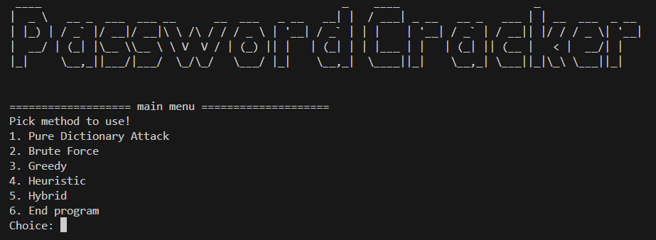
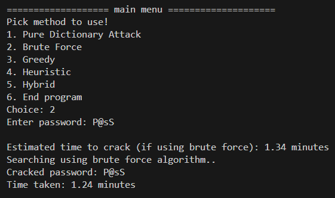
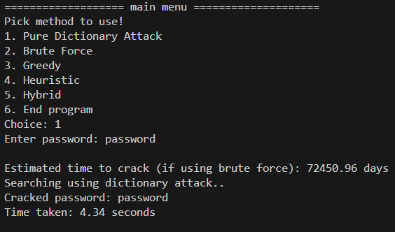
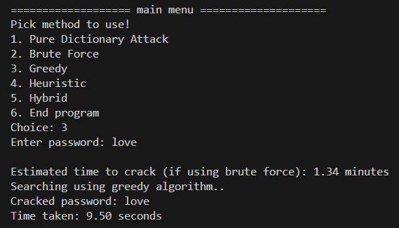
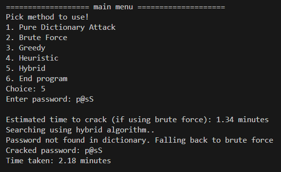

# Simple Password Cracking Program
> A password cracking program using brute force, greedy, heuristic, and hybrid algorithms

This project includes implementations of various password-cracking algorithms such as brute force, greedy, heuristic, and hybrid approaches to effectively and efficiently crack passwords. The program demonstrates how different algorithms can be combined to optimize the password-cracking process.

## Table Of Contents
* [Abstract](#abstract)
* [Repository Structure](#repository-structure)
* [Technologies Used](#technologies-used)
* [Features](#features)
* [Getting started](#getting-started)
* [Developing](#developing)
* [Screenshots](#screenshots)
* [Links](#links)

## Abstract
<p align="justify">Password security is a crucial aspect of modern computing. This project examines various password-cracking algorithms, including brute force, greedy, heuristic, and hybrid approaches. Brute force algorithms, while guaranteed to succeed, require extensive computational time. Greedy and heuristic algorithms can crack passwords more quickly but do not always guarantee success. The hybrid algorithm combines the strengths of brute force, greedy, and heuristic methods to optimize efficiency and effectiveness. This project aims to provide a practical tool for understanding and analyzing these different approaches.</p>

## Repository Structure 
```bash
.
├─── analysis
│   └─── data.jsonentropy_analysis
│ 
├─── doc
│   ├─── 13522075-Makalah-Stima-2024.pdf
│   └─── TugasMakalah2023.pdf
│ 
├─── screenshots
│   ├─── bruteForce.png
│   ├─── dictAttack.png
│   ├─── fallback.png
│   ├─── greedy.png
│   └─── main.png
│  
├─── src
│   ├─── database
│   │       ├─── dictionary.txt
│   │       └─── dictionary1.txt
│   │
│   ├─── brute_force_algorithm.py
│   ├─── dictionary_attack.py
│   ├─── greedy_algorithm.py
│   ├─── heuristic_algorithm.py
│   ├─── hybrid_algorithm.py
│   ├─── main.py
│   └─── utils.py
│
├─── .gitignore
├─── LICENSE
├─── README.md
├─── requirements.txt
├─── run.bat
├─── run.sh
├─── run.runTest.bat
└─── runTest.shj

```
## Technologies Used
- python
- ipynb

## Features
* Implement password cracking algorithms: brute force, greedy, heuristic, and hybrid

## Getting started

Make sure your Python is appropriate. Try running python --version, if not found, it means your Python installation is not correct. Required version >=3.12.2. Install the python libraries by running the command:

```shell
pip install requirements.txt
```

## Developing
To start trying/modifying code, you need to clone the repository first
```shell
git clone https://github.com/MarvelPangondian/Simple-Password-Cracker.git
cd Simple-Password-Cracker
pip install requirements.txt
```
To run program in windows:

```shell
run.bat
```
To run program in *wsl* :
```
chmod +x run.sh
./run.sh
```

## Screenshots

<br><br>
<br><br>
<br><br>
<br><br>
<br><br>

## Links
- Repository: https://github.com/MarvelPangondian/Simple-User-Identification-Program
- Video : 
